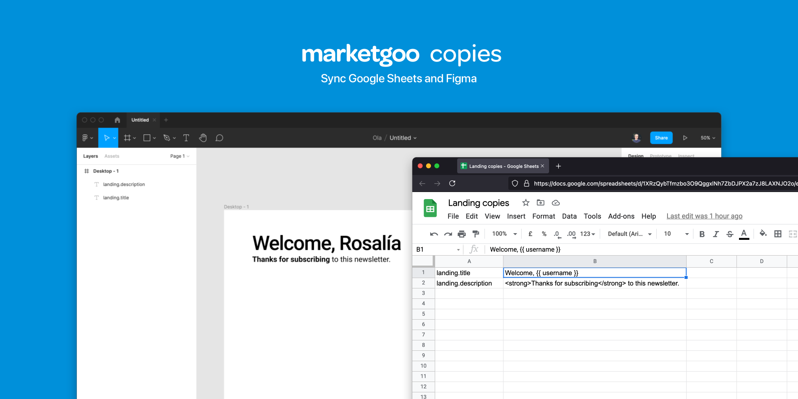

# Figma copies by marketgoo



## Usage

1. Create a Google Spreadsheet document with two columns. One for the copy id
   and other for the text.
2. Publish the document to web, and copy the url of the `.tsv`.
3. Run the plugin in Figma and paste the `.tsv` url.
4. All text layers with the same name of any copy id will be updated with the
   copy text.

### Other features:

- If the text contains a `{{ varname }}` pattern, you can replace this variable
  with a value
- If the text contains any html code, like `Hello <strong>world</strong>`, it
  will be used to maintain the multiple styles in the same layer.

---

## Development guide

_This plugin is built with
[Create Figma Plugin](https://yuanqing.github.io/create-figma-plugin/)._

### Pre-requisites

- [Node.js](https://nodejs.org) – v16
- [Figma desktop app](https://figma.com/downloads/)

### Build the plugin

To build the plugin:

```
$ npm run build
```

This will generate a [`manifest.json`](https://figma.com/plugin-docs/manifest/)
file and a `build/` directory containing the JavaScript bundle(s) for the
plugin.

To watch for code changes and rebuild the plugin automatically:

```
$ npm run watch
```

### Install the plugin

1. In the Figma desktop app, open a Figma document.
2. Search for and run `Import plugin from manifest…` via the Quick Actions
   search bar.
3. Select the `manifest.json` file that was generated by the `build` script.

### Debugging

Use `console.log` statements to inspect values in your code.

To open the developer console, search for and run `Open Console` via the Quick
Actions search bar.

## See also

- [Create Figma Plugin docs](https://yuanqing.github.io/create-figma-plugin/)
- [`yuanqing/figma-plugins`](https://github.com/yuanqing/figma-plugins#readme)

Official docs and code samples from Figma:

- [Plugin API docs](https://figma.com/plugin-docs/)
- [`figma/plugin-samples`](https://github.com/figma/plugin-samples#readme)
